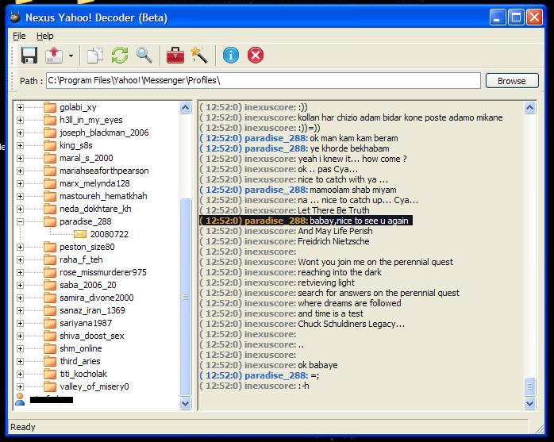



## Nexus Yahoo\! Decoder \(BETA\)

### Description

Well ive seen couple of programs over the internet in attempt to decode yahoo! messenger archive files. as you may know, yahoo! messenger stores your chat archives on your disk and you can read them offline if you could decode them. well if you must know these archives are not encrypted, but they're just coded with a simple XOR algorithm. ive seen some attempts so i decided to make one my own way. this program is an attempt to decode yahoo! messenger archive files.

with this program you can select the root directory for yahoo! messenger profiles, as default "C:\Program Files\Yahoo!\Messenger\Profiles", and then select the buddy you want, decode your archives and then save the decoded message into Text,RTF and HTML file formats.

there are two more options included which you can backup all your chat archives into zip files (using free XZip library), and one to enable profiles archiving option in registry.

although this is a good and useful program, it still needs more work, the algorithm is not 100% completed yet, the problem is that you cannot decode archive files without having your yahoo! id and your buddy yahoo! id, so it needs more work. also im willing to add another feature for adding yahoo Emoticons in the RichTextBox control instead of they're codes.

this program uses some controls listed bellow, and can be found in the Control folder in source code:

MS Common Controls 6.0, 3-6.0

MS RichTextBox 6.0

MS CommonDialog control 6.0

Hook Menu Control (PSCode)

XZip library, and the MS ScriptingRuntime library.

hope its useful as a source code and as a free desktop utility for all. feel free to report any bugs or suggestions.

enjoy, INexusCore.
 
### More Info
 
Hook Menu Control and Extra Timer controls are deleted by PSCode from source code, they can be found on PSCode :

Hook Menu Control:

http://www.pscode.com/vb/scripts/ShowCode.asp?txtCodeId=49985&amp;lngWId=1

Extra Timer Control:

http://www.pscode.com/vb/scripts/ShowCode.asp?txtCodeId=42792&amp;lngWId=1

             |
---                |---
**Submitted On**   |2008-07-24 15:43:34
**By**             |[INexusCore](https://github.com/Planet-Source-Code/PSCIndex/blob/master/ByAuthor/inexuscore.md)
**Level**          |Advanced
**User Rating**    |5.0 (10 globes from 2 users)
**Compatibility**  |VB 5\.0, VB 6\.0
**Category**       |[Complete Applications](https://github.com/Planet-Source-Code/PSCIndex/blob/master/ByCategory/complete-applications__1-27.md)
**World**          |[Visual Basic](https://github.com/Planet-Source-Code/PSCIndex/blob/master/ByWorld/visual-basic.md)
**Archive File**   |[Nexus\_Yaho2121647242008\.zip](https://github.com/Planet-Source-Code/inexuscore-nexus-yahoo-decoder-beta__1-70876/archive/master.zip)

### API Declarations

a few, see the code.

